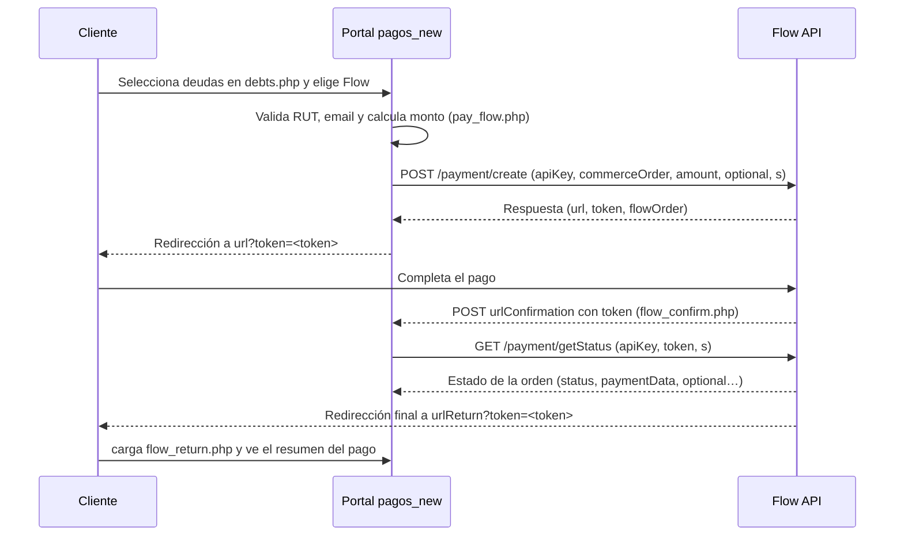

# Flow – Pago en Portal HomeNet

## Resumen
La integración Flow permite que un cliente pague las deudas seleccionadas en el portal, redirigiéndose a Flow para completar el pago. El proceso se inicia desde `pay_flow.php`, utiliza `App\Services\FlowPaymentService` para crear la orden y termina con respuestas manejadas por `flow_confirm.php` (callback servidor a servidor) y `flow_return.php` (retorno del cliente).

Documentación oficial: <https://developers.flow.cl/api#section/Introduccion/Realizar-pruebas-en-nuestro-ambiente-Sandbox>

## Archivos relevantes
- `app/Config/flow_credentials.php`: credenciales y ambiente por defecto. También pueden sobreescribirse vía variables de entorno.
- `app/Config/app.php`: carga la configuración Flow (URLs, callbacks, defaults).
- `app/Services/FlowPaymentService.php`: firma parámetros con HMAC-SHA256, consume `/payment/create` y `/payment/getStatus`.
- `pay_flow.php`: valida deudas mientras prepara la orden y redirige al cliente.
- `flow_confirm.php`: endpoint que Flow invoca por POST con el `token` para confirmar el estado.
- `flow_return.php`: consulta el estado del pago usando el `token` y muestra el resultado al cliente.
- `app/logs/flow*.log`: archivos donde se registran las solicitudes, respuestas y errores asociados al flujo.

## Parámetros clave
- `apiKey`: identificador del comercio (obligatorio). Se obtiene desde el panel Flow (`flow_credentials.php`).
- `secretKey`: clave privada para firmar (obligatoria).
- `commerceOrder`: identificador único generado por el portal (`pay_flow.php`, máximo 40 caracteres).
- `subject`: descripción fija enviada como “Pago de servicios HomeNet”.
- `amount`: suma de las deudas seleccionadas (en CLP).
- `email`: correo del pagador (validado previamente).
- `optional`: JSON con datos adicionales (`rut`, `email`, `selected_ids`).
- `urlConfirmation`: URL del callback (`flow_confirm.php`).
- `urlReturn`: URL donde Flow redirige al cliente (`flow_return.php`).
- `token`: hash devuelto por Flow que identifica la transacción. Se concatena a la URL de redirección y se utiliza en `getPaymentStatus`.
- `status`: código numérico del estado de la orden (1 pendiente, 2 pagada, 3 rechazada, 4 anulada).

## Flujo de trabajo

## Detalles operativos
1. **Inicialización**: `pay_flow.php` carga la configuración (`config_value('flow')`) y crea la orden con `FlowPaymentService::createPayment`. Si la API responde correctamente, persiste datos en `$_SESSION['flow']['last_transaction']`.
2. **Redirección**: se forma la URL final `response['url'] . '?token=' . response['token']` y se redirige al cliente automáticamente.
3. **Callback**: `flow_confirm.php` exige método POST y el parámetro `token`. Consulta `getPaymentStatus` y registra la respuesta. Aquí es el punto sugerido para integrar procesos internos (marcar deudas como pagadas, enviar correos, etc.).
4. **Retorno del cliente**: `flow_return.php` llama nuevamente a `getPaymentStatus` usando el token recibido en la URL. Dependiendo de `status`, muestra mensajes personalizados y un resumen.
5. **Logging**: cada fase genera logs (`flow.log`, `flow-error.log`, `flow-callback.log`, `flow-return.log`) que ayudan a auditar y depurar.

## Consideraciones
- Asegúrate de que `app/logs` sea escribible por PHP.
- Actualiza `url_confirmation` y `url_return` si cambias el dominio o ruta pública.
- Si Flow entrega nuevos parámetros en la respuesta, `FlowPaymentService` los conservará en el arreglo y estarán disponibles en los logs.
- Mantén protegidos `flow_credentials.php` y las variables de entorno; el `.gitignore` evita que se suban a control de versiones.
- Para pruebas usa el ambiente `sandbox`; en `flow_credentials.php` se puede cambiar el valor `environment` o definir `FLOW_ENVIRONMENT`. Si sandbox no está disponible, cambia el valor a `production` para apuntar a `https://www.flow.cl/api`.
- Puedes revisar respuestas recientes desde el navegador visitando `flow_debug.php`, que muestra la última transacción en sesión y las últimas líneas de los logs (`flow.log`, `flow-callback.log`, `flow-return.log`, etc.). Sólo úsalo en ambientes controlados.
- Credenciales de tarjeta de prueba (Chile):
  - Número: `4051885600446623`
  - Mes/Año: cualquiera
  - CVV: `123`
- Para la simulación del banco: Rut `11111111-1`, clave `123`.
- En sandbox puedes probar además medios alternativos (Servipag, Multicaja, Mach, Cryptocompra) que Flow habilita sin impacto real.

## Guía rápida de pruebas en sandbox
1. Configura el ambiente en sandbox (`flow_credentials.php` o variable de entorno).
2. Ingresa al portal `index.php`, consulta deudas y selecciona el botón Flow.
3. Flow redirigirá a la interfaz de sandbox; usa la tarjeta de prueba o Rut/clave de la simulación según el medio escogido.
4. Completa el flujo; Flow enviará el callback a `flow_confirm.php` y te devolverá a `flow_return.php` con el resumen del pago.
5. Revisa los logs `app/logs/flow*.log` para confirmar payloads y estados.
