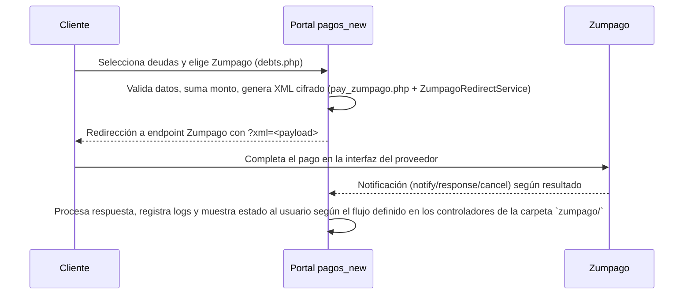

# Zumpago – Pago en Portal HomeNet

## Resumen
La integración con Zumpago habilita un flujo de redirección donde el portal construye un XML encriptado con las llaves provistas por Zumpago, lo envía como parámetro y deja a Zumpago encargarse del cobro. El código principal está en `pay_zumpago.php` y utiliza `App\Services\ZumpagoRedirectService` para generar los datos de redirección.

## Archivos relevantes
- `app/Config/app.php` (`zumpago`): define llaves, IV, códigos, métodos de pago y URLs de cada ambiente.
- `app/Services/ZumpagoRedirectService.php`: arma el XML, aplica padding, genera código de verificación y cifra con 3DES.
- `pay_zumpago.php`: valida las deudas, invoca al servicio y redirige al pagador.
- `zumpago/notify.php`, `zumpago/response.php`, `zumpago/cancel.php`: manejan notificaciones y retornos provenientes de Zumpago.
- `app/logs/zumpago.log`: registra la carga útil enviada (RUT, monto, ids, URL generada) para auditoría.

## Parámetros clave
- `company_code`: identificador del comercio en Zumpago (obligatorio).
- `xml_key`: llave para cifrar el XML (`DES-EDE3`).
- `verification_key`: llave para generar el código de verificación (`CodigoVerificacion`).
- `iv`: vector de inicialización (8 caracteres).
- `payment_methods`: lista de medios disponibles para el comercio (ej. `016`).
- `urls`: endpoints por ambiente (`production`, `certification`, etc.).
- `response_url`, `notification_url`, `cancellation_url`: endpoints hosteados por HomeNet que Zumpago invoca según el resultado.
- `IdTransaccion`: generado en `ZumpagoRedirectService::generateTransactionId` combinando RUT y timestamp (13 dígitos).
- `CodigoVerificacion`: resultado de cifrar los campos padded con `verification_key` (garantiza integridad).
- `xml`: payload XML ISO-8859-1 enviado a Zumpago. Claves: `IdComercio`, `IdTransaccion`, `Fecha`, `Hora`, `MontoTotal`, `MediosPago`, `CodigoVerificacion`.
- `xml_encrypted`: versión cifrada que se agrega a la URL como parámetro `xml`.

## Flujo de trabajo

## Detalles operativos
1. **Preparación de datos**: `pay_zumpago.php` repite la validación que compartimos con otros medios (RUT, email, deudas) y calcula `totalAmount`.
2. **Generación del XML**:
   - `ZumpagoRedirectService::createRedirectData` arma un arreglo base con fecha (`Ymd`), hora (`His`), ids de documentos y total.
   - Calcula `CodigoVerificacion` cifrando los campos padded (`IdComercio`, `IdTransaccion`, `Fecha`, `Hora`, `MontoTotal`) con `verification_key`.
   - Construye el XML en ISO-8859-1 y lo cifra con `xml_key`.
   - Devuelve `redirect_url` listo para que el navegador lo cargue.
3. **Sesión y logging**: la información generada se almacena en `$_SESSION['zumpago']['last_transaction']` y se registra en `app/logs/zumpago.log` junto con el endpoint utilizado.
4. **Redirección**: el navegador es enviado a la URL generada (se hace también por `window.location.href` para asegurarse).
5. **Callbacks**: Zumpago invoca `response.php`, `notify.php` y `cancel.php` según corresponda. Estos puntos son donde debes implementar la lógica de actualización interna o mostrar estados específicos.

## Consideraciones
- El servicio exige llaves exactas y un IV de 8 caracteres; cualquier alteración produce errores de cifrado.
- La salida XML se genera con encoding ISO-8859-1, acorde con especificaciones de Zumpago.
- Asegúrate de manejar los eventos en `zumpago/*.php` para completar el ciclo (confirmaciones, rechazos, cancelaciones).
- `payment_methods` determina los medios permitidos; si Zumpago modifica el catálogo habrá que actualizar este valor.
- Revisa `zumpago.log` para auditar transacciones y depurar integraciones.

## Datos de prueba (ambiente certificación)
- **Tarjeta de crédito**: 4051 8856 0044 6623
- **CVV**: 123
- **Fecha de vencimiento**: 06/26
- **RUT**: 11.111.111-1
- **Clave**: 123
